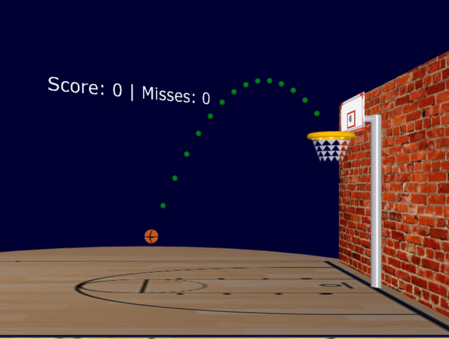
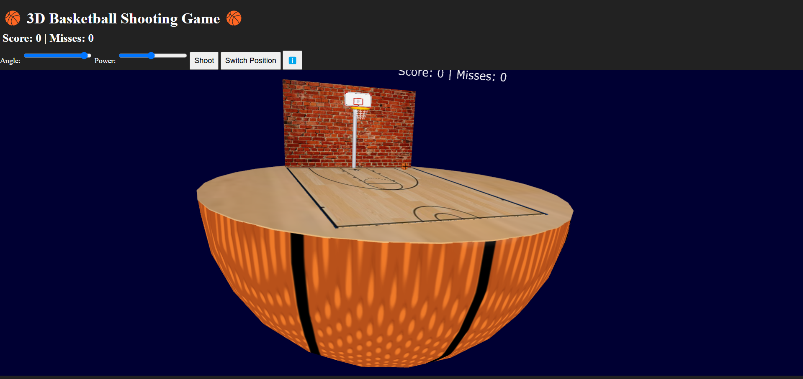
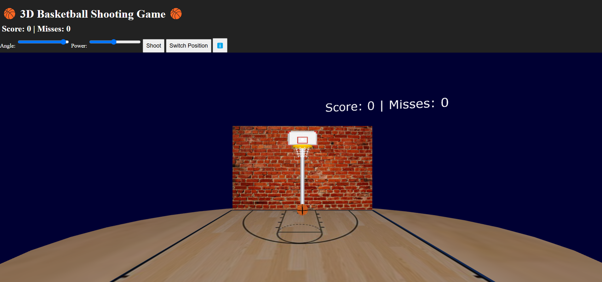

# 3D Basketball Shooting Game in X3DOM

## Project Overview
The **3D Basketball Shooting Game** is an interactive web-based game developed using **X3DOM, JavaScript, HTML, and CSS**. It features realistic shooting mechanics, an interactive 3D scoreboard, dynamic controls, and a toggleable day/night mode. Players can adjust shooting angle and power, switch positions, and shoot dynamically, with physics-based ball trajectory calculations.

## Features
### Shooting Mechanics
- **Player Positioning:** Switch between **free-throw** and **3-point line** positions.
- **Angle & Power Control:** Adjustable sliders to fine-tune shots.
- **Realistic Physics:** Gravity-based parabolic trajectory simulation.
- **Trajectory Preview:** Visual indicators to predict the ball's flight.

### Scoreboard & Feedback
- **3D Billboard Scoreboard:** Updates dynamically based on score and misses.
- **In-Window UI Scoreboard:** Displays real-time game statistics.
- **Sound Effects:** Cheers on successful shots, boos on missed shots.

### Scene & Camera Controls
- **Toggle Day/Night Mode:** Adjust lighting dynamically.
- **Multiple Camera Angles:**
  - `1` → Front View
  - `2` → Side View
  - `3` → Bird’s Eye View
  - `4` → Full Scene View
- **Keyboard Controls:**
  - `Space` → Shoot
  - `S` → Switch Position
  - `W` → Toggle Day/Night Mode

## Technologies Used
| Technology  | Purpose |
|------------|---------|
| **X3DOM (X3D)** | 3D rendering, scene graph management |
| **JavaScript** | Game logic, physics, interactivity |
| **HTML** | UI structure for controls & display |
| **CSS** | Styling & responsive design |

## Installation & Setup
1. Download x3d
2. Clone this repository.
3. Navigate to the project folder.
4. Open `basketball.html` in your browser.

## Code Highlights
### Ball Physics & Shooting Mechanics (`shootBall()`)
- Calculates **velocity & trajectory** using physics.
- Handles **rim bounces, backboard interactions, and scoring detection**.
- Updates **ball movement** at high frame rates for smooth animation.

### Dynamic Scoreboard (`updateScoreboard()`)
- Updates **HTML & 3D floating scoreboard**.
- Provides **visual & color feedback** based on shot results.

### Real-Time Trajectory Preview (`updateTrajectory()`)
- Predicts **shot path** before execution.
- Updates dynamically as **angle & power** change.

### Toggle Day/Night Mode (`toggleDayNight()`)
- Adjusts **lighting, sky color, and court brightness**.
- Press `W` to switch modes instantly.

## Screenshots

## Future Enhancements
- **Physics-based net interactions**.
- **Multiplayer mode**.
- **Leaderboard system**.

## Author
**lolwyer**

